# MINITUBE

A simplified YouTube-style video sharing web app built with **PHP** and **MySQL**.  
Users can browse subscription feeds, open channels, watch videos, leave threaded comments, manage playlists, and run live SQL queries against the project database.

---

## Features

- **Database setup from the browser** — one-click initialize (create DB, tables, seed data)
- **Authentication** — login and optional registration
- **Home feed** — videos from subscribed channels, search, category browse, sorting
- **Top 5 channels** — ranked by subscriber count (`GROUP BY` + `COUNT`)
- **User profile** — name, country, join date, bio, own channel, subscription list
- **Channel pages** — details, video list, subscribe / unsubscribe
- **Watch page** — YouTube embed, view counter, popularity badge (`SQL CASE`), likes
- **Threaded comments** — top-level comments + replies (single query with self-join)
- **Playlists** — create playlists and save videos
- **SQL Console** — run `SELECT` / `INSERT` / `UPDATE` / `DELETE` and see results live

---

## Screenshots

### Getting started

| Initialize database | Login |
|:-------------------:|:-----:|
|  | 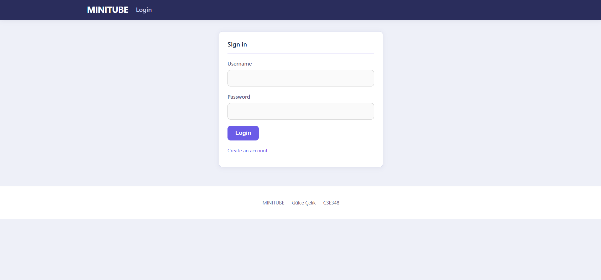 |

### Home & profile

| Subscription feed | Profile & subscriptions |
|:-----------------:|:-----------------------:|
| 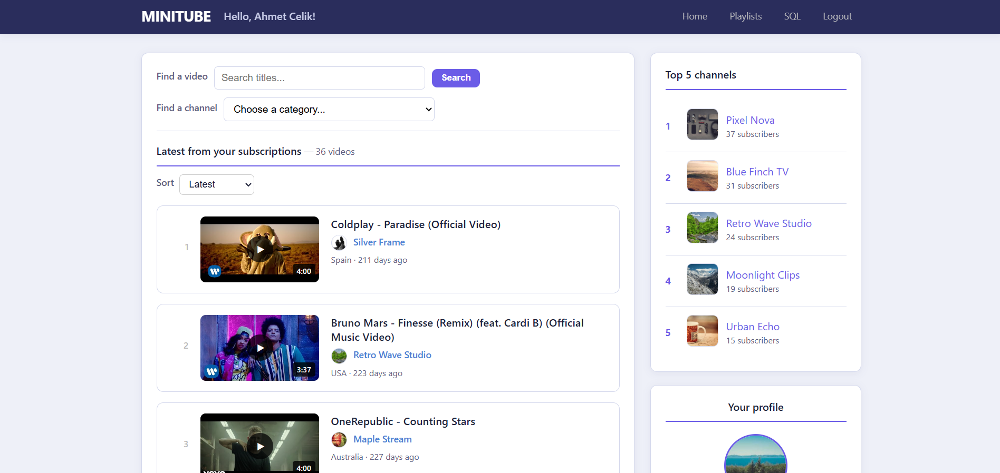 | 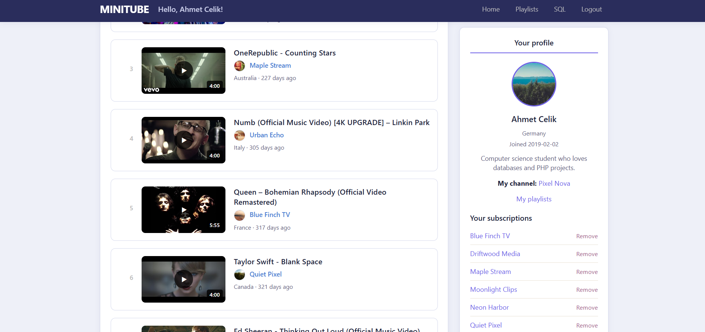 |

### Channels & playlists

| Own channel | Subscribe to a channel | Playlists |
|:-----------:|:----------------------:|:---------:|
| 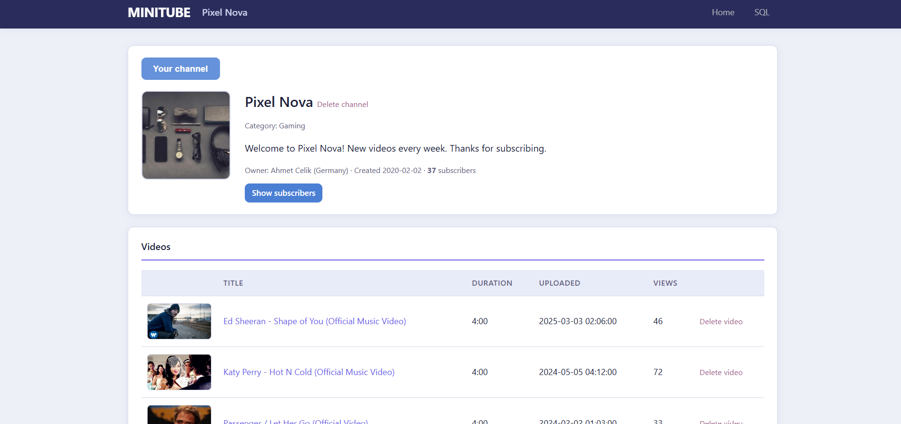 | 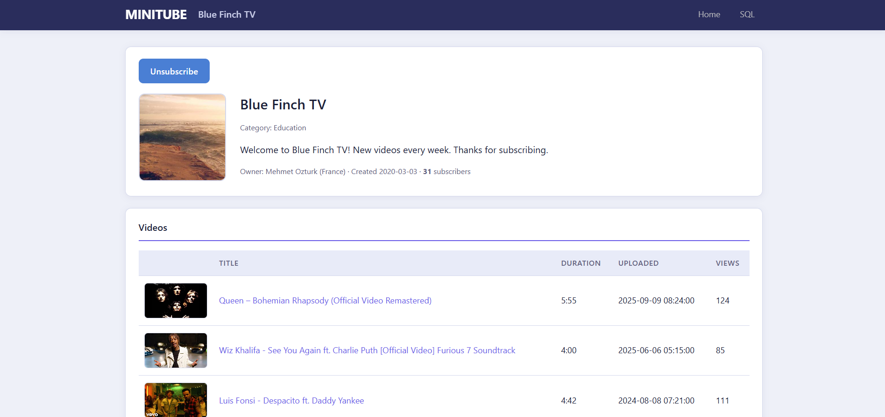 | 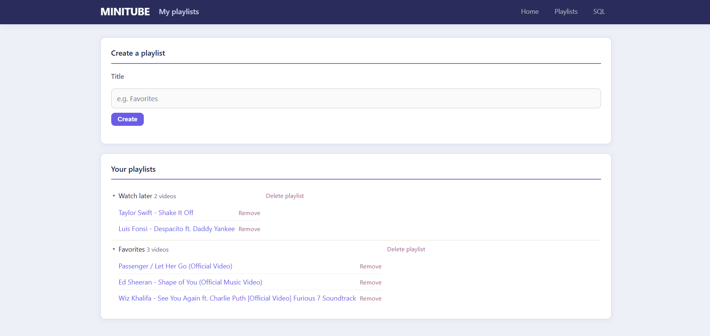 |

### Watch & comments

| Watch page | Comments & replies |
|:----------:|:------------------:|
| 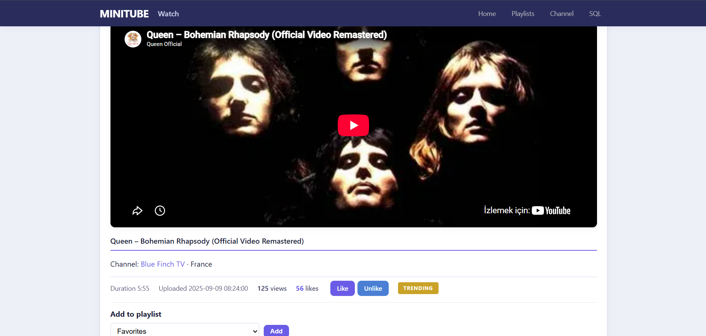 | 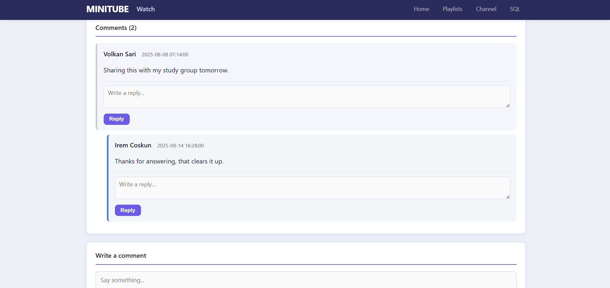 |

### SQL Console

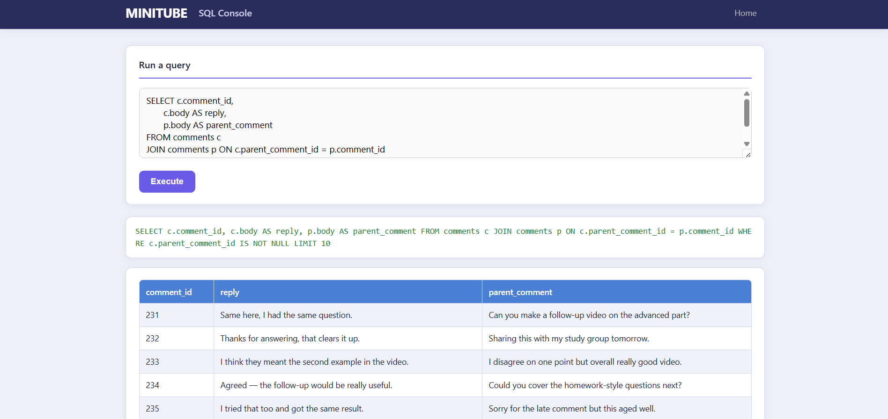

---

## Database diagrams

| ER Diagram | Relational Diagram | Action Flow |
|:----------:|:------------------:|:-----------:|
| 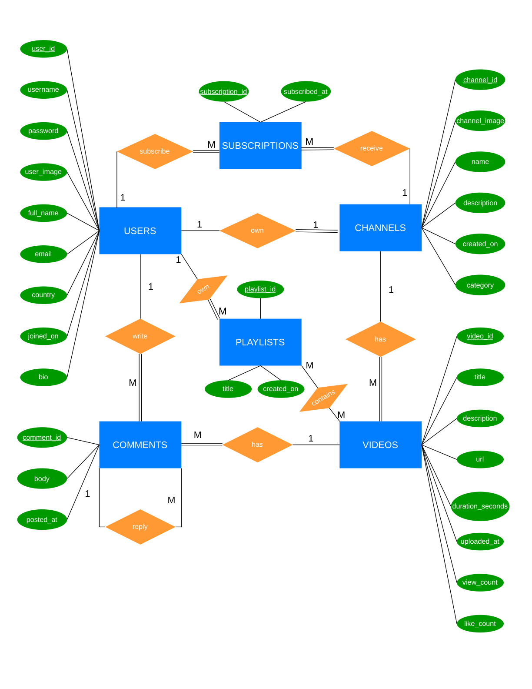 | 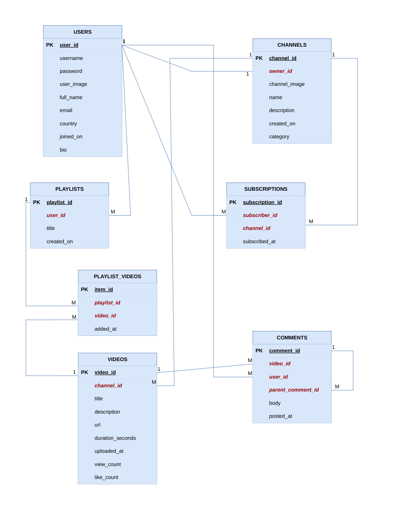 | 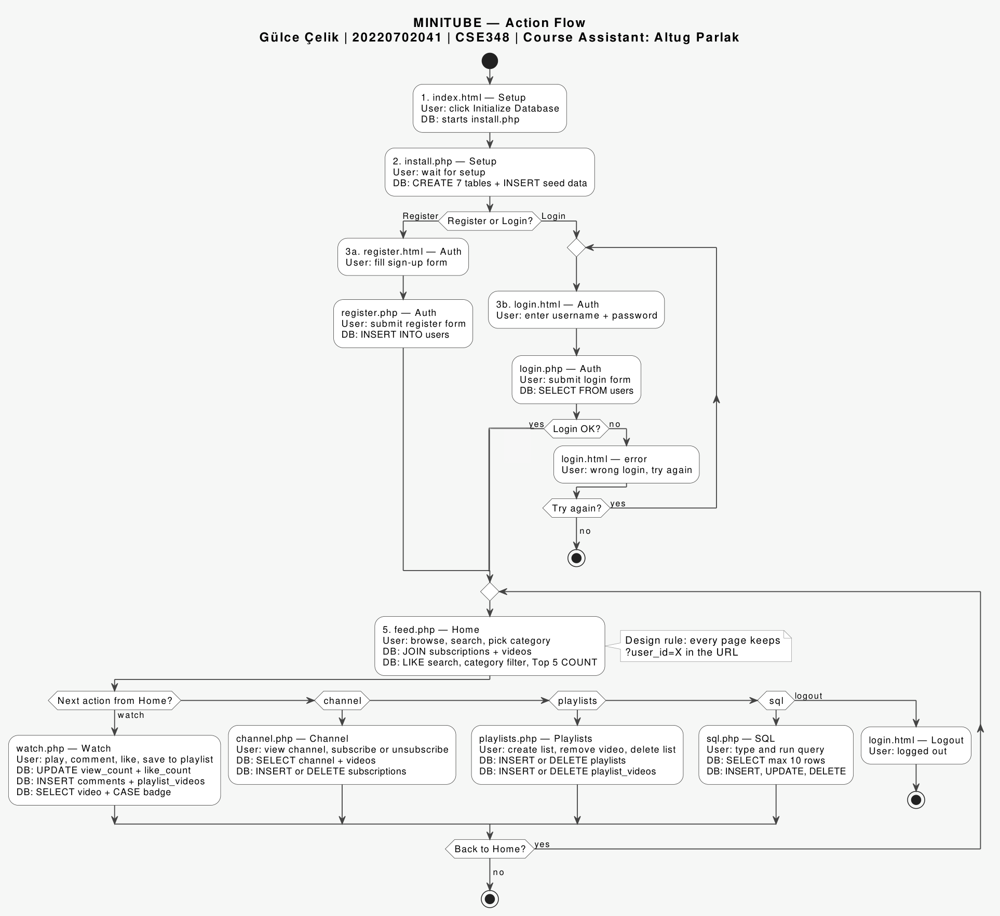 |

PDF versions are in [`diagrams/`](diagrams/):
- `ER_Diagram.pdf`
- `Relational_Diagram.pdf`
- `ActionFlowDiagram.pdf`

---

## Tech stack

- PHP (mysqli)
- MySQL
- HTML / CSS
- AMPPS (or any local Apache + MySQL stack)

---

## Requirements

- AMPPS, XAMPP, or similar (Apache + MySQL + PHP)
- PHP with **mysqli** enabled
- A modern browser

Default `config.php` values (AMPPS on Windows):

| Setting | Value |
|---------|--------|
| Host | `localhost` |
| Port | `3307` |
| User | `root` |
| Password | `mysql` |
| Database | `gulce_celik` |

Update `config.php` if your MySQL port or password is different.

---

## Setup

1. **Start Apache and MySQL** in AMPPS (or your stack).

2. **Copy the project** into your web root, for example:
   ```text
   C:\Program Files\Ampps\www\MINITUBE
   ```

3. **Open the app** in the browser:
   ```text
   http://localhost:8080/MINITUBE/index.html
   ```
   (Port may be `80` or `8080` depending on your AMPPS settings.)

4. Click **Initialize Database**.  
   This regenerates `seed.sql`, creates the database and tables, loads seed data, then redirects to login.

5. Sign in with the demo account:
   - **Username:** `ahmet1`
   - **Password:** `pass1`

6. Explore Home, channels, watch, playlists, and the SQL Console.

---

## Project structure

```text
MINITUBE/
├── index.html          # Start page (initialize DB)
├── install.php         # Creates DB + tables + loads seed
├── generate_data.php   # Builds seed.sql from data/*.txt
├── seed.sql            # Generated INSERT statements
├── config.php          # MySQL connection settings
├── db.php              # Connection + shared helpers
├── layout.php          # Shared header / footer
├── login.html / login.php
├── register.html / register.php
├── feed.php            # Home after login
├── channel.php         # Channel page
├── watch.php           # Video + comments
├── playlists.php       # Playlist management
├── sql.php             # Live SQL console
├── style.css
├── assets/             # Placeholder images
├── data/               # Text inputs for seed generation
├── diagrams/           # ER, relational, action-flow diagrams
└── docs/screenshots/   # UI screenshots
```

---

## Example SQL (SQL Console)

```sql
SELECT c.name AS channel,
       COUNT(s.subscription_id) AS subscribers
FROM channels c
LEFT JOIN subscriptions s ON c.channel_id = s.channel_id
GROUP BY c.channel_id, c.name
ORDER BY subscribers DESC
LIMIT 10;
```

```sql
SELECT title,
       view_count,
       CASE
           WHEN view_count >= 1000 THEN 'Popular'
           WHEN view_count >= 100 THEN 'Trending'
           ELSE 'New'
       END AS badge
FROM videos
ORDER BY view_count DESC
LIMIT 10;
```

`SELECT` results are limited to **10 rows**.  
`INSERT` / `UPDATE` / `DELETE` show the affected row count. Invalid queries show the MySQL error.

---

## License

This project was created for educational / course purposes.
